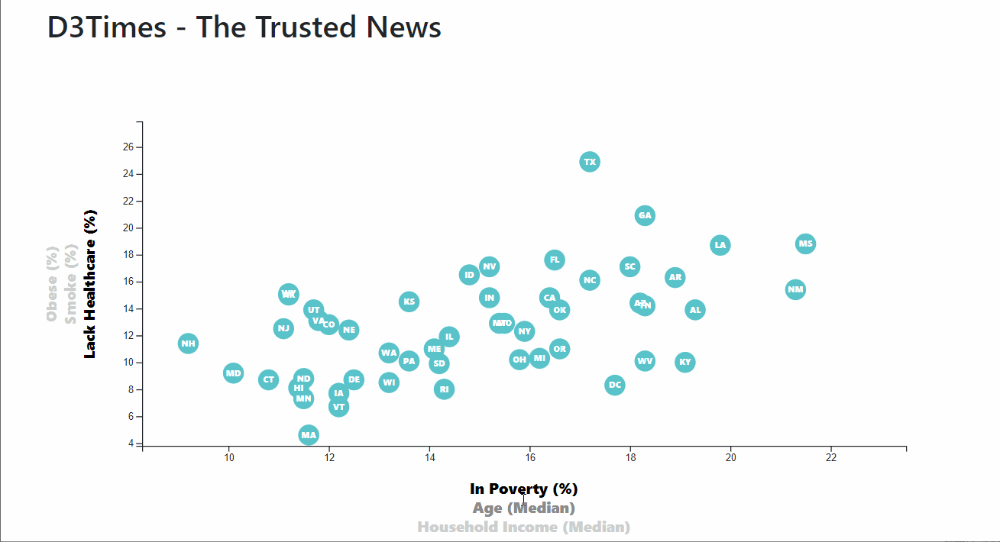

In this activity, I use the data from 2014 ACS 1-year estimates https://factfinder.census.gov/faces/nav/jsf/pages/searchresults.xhtml.

The purpose is to use D3 to demonstrate the ability to build a personal customised interactive chart using D3 to visualise the relationship between health risks and social demography backgrounds.

We can see there are some correlation between Poverty and lack of healthcare, or correlation between obesity and household Income...

Visit https://datng87.github.io/D3-challenge/ for a live demo website. 